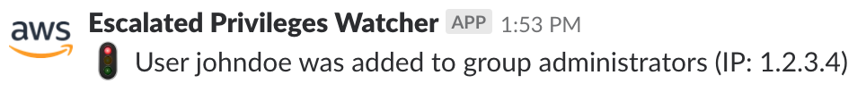
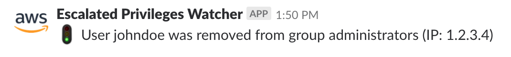

# PAW: Privileged Access Watcher

This goal of this project is to watch privileged IAM groups in AWS
for membership additions and deletions, then notify a specific Slack
channel for visibility and notification to the affected person.

All of this is accomplished in an automated fashion, with a reaction
time of 1-2 minutes of the membership event occurring.  This relies on
a CloudWatch Event Rule, Lambda function, and Slack Incoming Webhook.

When a user is added to a group, the following Slack message appears in a
channel:

Conversely, when a user is removed from a group, the following message
appears:

## Launching the Project

Since the IAM component being monitored is a global resource, the
AWS resources are all created in one region.

1. Deploy the IAM resources.

  Run `make deploy-iam-stack` and follow the prompts.

1. Set the Slack Webhook URL into SSM ParameterStore

  Run `make init-ssm` and follow the prompts.

1. Deploy the code resources.

  Run `make deploy-code-stack` and follow the prompts.

1. Prepare the Lambda function for code deployment.

  Run `make prepare-code-stack` and follow the prompts.

1. Deploy the code.

  Run `make deploy-code` and follow the prompts.

The code deploy step can happen as frequent as needed, while the 
infrastructure stack will update rarely.  If the infrastructure
does need to be updated, it is best to use CloudFormation Change Sets
to control the update and enforce change management.

## Custom Slack Emojis

This project uses custom Slack emojis to personalize the messages sent
to Slack.  You can find the custom emojis in the
[extras/emojis](extras/emojis) directory.  Customize your Slack emojis
by uploading the PNG files with the names specified in
[constants.go](constants.go).
